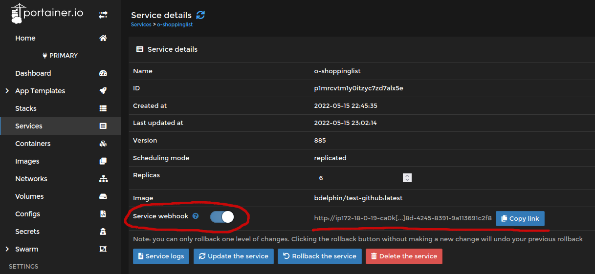
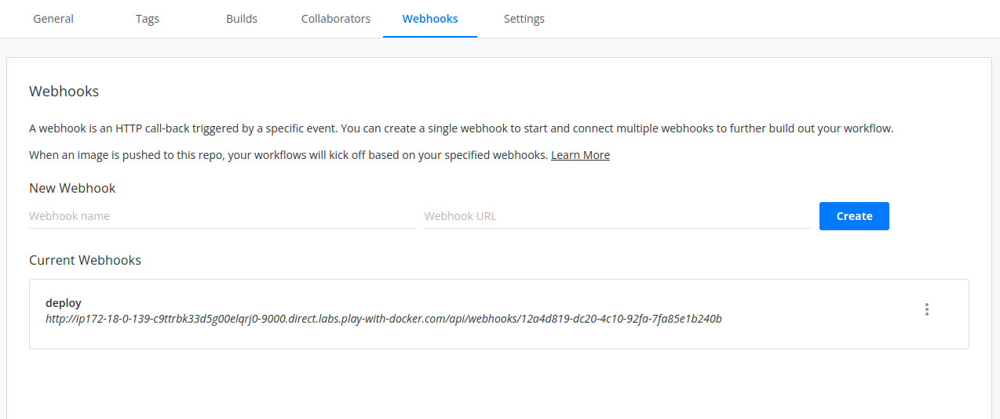

# Docker Swarm & Portainer

Pour la mise en production de notre application, nous allons utiliser [**Docker Swarm**](https://docs.docker.com/engine/swarm/), un orchestrateur de conteneurs intégré à Docker.

Nous utiliserons aussi [**Portainer**](https://www.portainer.io/), une interface web pour gérer des clusters de conteneurs.

## Orchestration de conteneurs

Nous l'avons vu au préalable, les conteneurs Docker peuvent servir en production. Dans le cadre d'une démarche DevOps, nous devons surveiller/monitorer notre production, afin d'assurer la meilleure disponibilité de notre application.

Or, le seul outil que nous avons vu jusque là pour surveiller l'état de nos conteneurs, c'est la commande `docker ps`. De plus, si un conteneur tombe en panne, il ne sera pas relancé automatiquement. En cas d'augmentation soudaine de la charge de notre application, nous n'avons pas non plus de système permettant facilement de soutenir cette montée en charge.

La réponse à toutes ces problèmatiques ? **L'orchestration de conteneurs** ! L'orchestration de conteneurs permet d'automatiser le déploiement, la gestion, la mise à l'échelle et la mise en réseau des conteneurs.

Plusieurs solutions d'orchestration de conteneurs existent, les plus connues sont Kubernetes, Docker Swarm et Apache Mesos. La plus populaire de nos jours est définitivement Kubernetes, mais dans le cadre de ce cours nous allons mettre en place Docker Swarm, solution moins puissante mais très rapide à mettre en place !

## Mise en place de Docker Swarm

Il nous faut au moins deux machines Linux en réseau pour créer un cluster Docker Swarm. Dans notre cas, nous allons utiliser [Play With Docker](https://labs.play-with-docker.com/).

Démarrer une session PWD et créez 2 instances.

:memo: Sur PWD (avec Google Chrome), vous pouvez copier avec Ctrl+Insert ou clic molette sur votre souris, et coller avec Ctrl+Shift+V. Sur Firefox, vous pouvez copier avec Click droit > Copier et coller avec le clic molette.

Sur la première instance / le premier noeud (node1), nous allons initialiser le "swarm" avec la commande suivante : `docker swarm init --advertise-addr <NODE1-IP>`. Remplacez bien `<NODE1-IP>` par l'adresse IP du noeud sur le réseau. Ce noeud / cette machine est maintenant le **manager** du cluster.

Le Swarm est initialisé, il va maintenant falloir le rejoindre depuis autres noeuds, qu'on appelle les **workers**. Copiez la commande `docker swarm join` qui s'affiche à l'écran.

Sur le deuxième noeud PWD que nous avons créé, collez cette commande. Si tout s'est bien passé, vous devriez avoir un message "This node joined a swarm as a worker".

Et voilà, nous venons de créer notre premier cluster Docker Swarm :tada: Si on voulait ajouter d'autres machines au cluster, il suffirait de lancer la commande `docker swarm join` sur les machines en question.

:bulb: Sur le manager, vous pouvez lancer la commande `docker node ls` pour avoir des informations sur le cluster et les différents noeuds qui le composent.

## Lancement d'un service

Sur ce cluster, nous n'allons pas faire tourner un conteneur, mais un **service**. Ce service sera démarré à partir d'une image, lancée sur un ou plusieurs réplicas (des conteneurs).

Pour démarrer un service, on utilise la commande `docker service create --replicas 2 --name my_first_service <image_docker>`.

Démarrons un service avec notre application O'ShoppingList que nous avons poussé sur le DockerHub hier. Lancez la commande suivante :

`docker service create --replicas 4 -dp 80:80 --name o-shoppinglist <dockerhub_user>/o-shoppinglist`

Pour vérifier l'état du service, vous pouvez utiliser la commande `docker service ps o-shoppinglist`. Pour le stopper/supprimer, `docker service rm o-shoppinglist`.

Cliquez sur `Open Port` et choisissez le port 80. Vous devriez voir notre application en ligne !

## Intéret du cluster

Docker Swarm répartit automatiquement la charge entre les conteneurs grâce à son [**réseau maillé Ingress**](https://docs.docker.com/engine/swarm/ingress/).

Faire fonctionner notre application sur un cluster de plusieurs conteneur répartis sur plusieurs hôtes présente plusieurs intérets :

- Failover : si un des hôte ou un conteneur cesse de fonctionner, l'application reste en ligne !
- Meilleures performances : voir ci-dessous.

Pour démontrer l'amélioration des performances avec l'augmentation du nombre de conteneurs, nous allons utiliser l'outil [**wrk**](https://github.com/wg/wrk).

Cet outil n'est pas installé sur vos VMs / machines, je vais donc vous faire la démo de mon coté en lançant la commande `wrk -t12 -c400 -d30s http://<url-pwd>.direct.labs.play-with-docker.com`, une première fois après avoir lancé un seul réplica, une seconde fois après en avoir lancé 4.

Au boût de 30 secondes on peut comparer le nombre de requêtes traitées par seconde, qui est plus élevé plus le nombre de réplicas augmente (attention néanmoins à ne pas créer trop de noeuds, celà pourrait entrainer l'effet opposé).

## Persistence des données & PHPSESSID

Vous l'aurez sûrement remarqué, sur plusieurs réplicas l'authentification semble ne pas fonctionner et les données que nous ajoutons à la liste semblent disparaître aussi ... c'est parce que les sessions PHP et la base de données SQLite ne sont pas synchronisées entre les noeuds et conteneurs du cluster !

Nous pourrions mettre cela en place en utilisant un stockage cloud externe, que nous viendrions monter au démarrage de chaque conteneur du cluster, afin que tous partagent les mêmes données.

On verra peut-être ça en bonus si on a le temps !

## Portainer

Le cluster est opérationnel, mais son utilisation en ligne de commande n'est pas forcément très pratique. Nous ne pouvons pas non plus mettre à jour automatiquement l'image lancée sur notre service, nous devrions pour cela stopper et relancer le service après avoir fait un `docker pull` pour récupérer la dernière version de l'image.

La solution ? **Portainer** !

Portainer est une interface web conçue dans le but de faciliter l'administration d'un cluster de conteneur. Il est compatible avec Docker Swarm mais aussi avec son concurrent Kubernetes.

Pour l'installer, nous allons suivre la [documentation officielle](https://docs.portainer.io/v/ce-2.9/start/install/server/swarm/linux). 

Sur le manager, lancez les commandes suivantes : 

```bash
curl -L https://downloads.portainer.io/portainer-agent-stack.yml -o portainer-agent-stack.yml
docker stack deploy -c portainer-agent-stack.yml portainer
```

C'est tout, Portainer est installé ! Attendez quelques secondes le temps que Portainer démarre, puis rendez-vous sur le port 9000 de notre manager. Choisissez `adminoclock` comme nouveau mot de passe administrateur.

Cliquez sur le cluster `primary`, dans la partie services vous pourrez retrouver notre service `o-shoppinglist` (s'il est encore lancé). On peut ici configurer graphiquement toutes les options liées à notre service.

Cliquez sur Swarm > Go to cluster visualizer pour avoir un aperçu de la répartition des conteneurs sur nos deux noeuds.

## Mise en place d'un webhook

Avant de passer à la suite, nous allons activer une option très pratique de Portainer : le **webhook**.

Dans les paramètres de notre service, activez l'option `webhook` et copiez le lien généré :



Rendez-vous ensuite sur votre dépôt DockerHub, dans la section `Webhooks` Choisissez un nom pour ce webhook, ajoutez le lien généré par Portainer dans le champ `Webhook URL` et cliquez sur `Create`.



Modifiez le texte du bouton `Ajouter` dans le fichier `app.php`, puis commitez/poussez les modifications sur Github. Surveillez l'avancement du workflow : lorsque l'image sera poussée sur DockerHub, DockerHub enverra une requête HTTP GET vers l'URL du webhook. En recevant cette requête, Portainer viendra automatiquement mettre à jour l'image à l'intérieur du service :scream:

## Récap

Pour résumer, nous venons de démarrer un cluster de conteneurs Docker Swarm pour héberger notre application. Ce cluster est administrable via l'interface web Portainer.

Un webhook connecte DockerHub avec notre cluster : à chaque fois qu'on pousse une nouvelle version de l'image sur DockerHub, Portainer vient la récupérer et mettre à jour le service sur le cluster.

## La suite ! (HAProxy & SonarQube)

La suite dans un autre dépôt !
